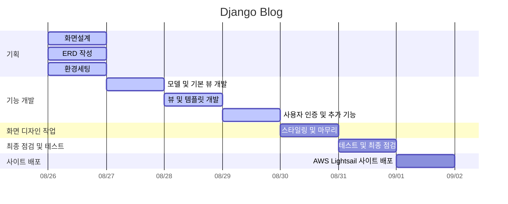
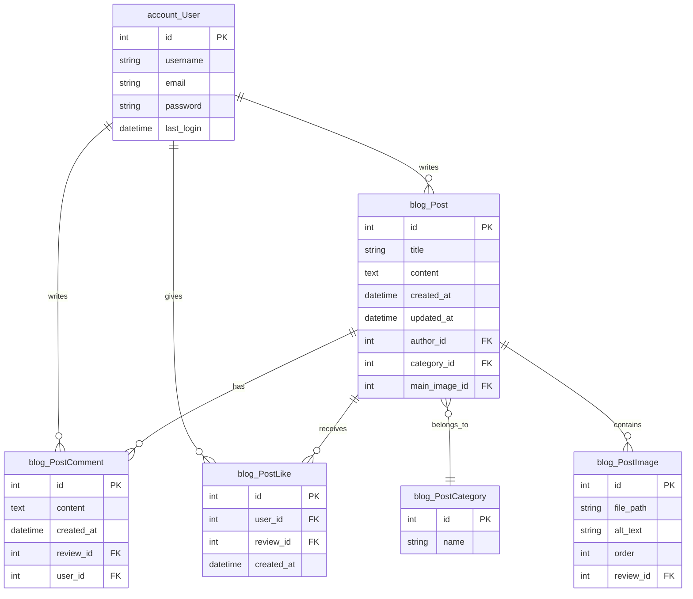

# 📚 ᗷOOKᒪOG
## 기술 스택
    

## 프로젝트 목표(작성중)
## 주요 기능(작성중)

## URL 구조(모놀리식)
- blog

| App      | URL                  | View Function  | HTML File Name         | Note                  |
|----------|----------------------|----------------|-------------------------|-----------------------|
| blog     | ‘/’                  | main           | blog/index.html         | 블로그 메인화면       |
| blog     | ‘post/<int:post_id>’ | post_detail    | blog/post-view.html     | 블로그 글 상세보기     |
| blog     | ‘post/add/’         | post_add       | blog/post_add.html      | 블로그 글 작성        |

- accounts

| App      | URL                  | View Function  | HTML File Name         | Note                  |
|----------|----------------------|----------------|-------------------------|-----------------------|
| accounts | ‘login/’            | auth_views     | accounts/login.html      | 로그인 페이지         |

## 프로젝트 일정(WBS)

## 데이터베이스 모델링(ERD)

## 화면 설계(작성중)

