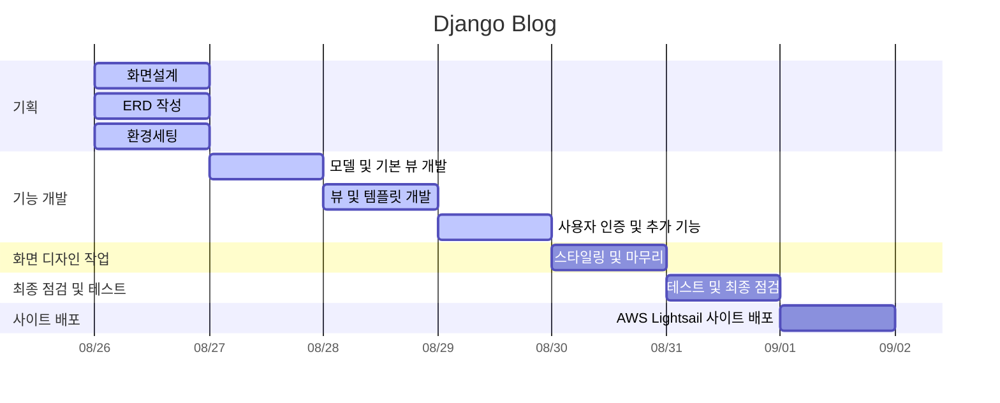
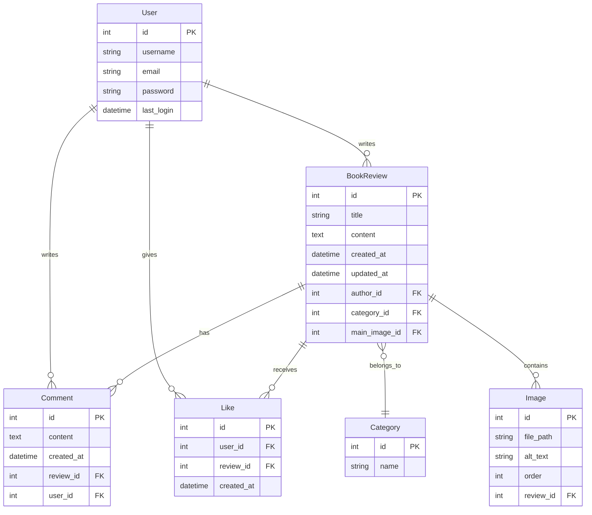

# 📚 ᗷOOKᒪOG
## 기술 스택
## 프로젝트 목표
## 주요 기능
## 프로젝트 일정(WBS)

```mermaid
gantt
    title Django Blog
    dateFormat YYYY-MM-DD
    axisFormat %m/%d
    tickInterval 1day
    section 기획
    화면설계    :active, 2024-08-26, 1d
    ERD 작성    :active, 2024-08-26, 1d
    환경세팅    :active, 2024-08-26, 1d
    section 기능 개발
    모델 및 기본 뷰 개발       :active,    2024-08-27, 1d
    뷰 및 템플릿 개발          :active,    2024-08-28, 1d
    사용자 인증 및 추가 기능   :active,  2024-08-29, 1d
    section 화면 디자인 작업
    스타일링 및 마무리         :         2024-08-30, 1d
    section 최종 점검 및 테스트
    테스트 및 최종 점검        :         2024-08-31, 1d
    section 사이트 배포
    AWS Lightsail 사이트 배포  :         2024-09-01, 1d
   
```

## 데이터베이스 모델링(ERD)

```mermaid
erDiagram
    User ||--o{ BookReview : writes
    User ||--o{ Comment : writes
    User ||--o{ Like : gives
    BookReview ||--o{ Comment : has
    BookReview ||--o{ Like : receives
    BookReview }o--|| Category : belongs_to
    BookReview ||--o{ Image : contains

    User {
        int id PK
        string username
        string email
        string password
        datetime last_login
    }
    BookReview {
        int id PK
        string title
        text content
        datetime created_at
        datetime updated_at
        int author_id FK
        int category_id FK
        int main_image_id FK
    }
    Image {
        int id PK
        string file_path
        string alt_text
        int order
        int review_id FK
    }
    Comment {
        int id PK
        text content
        datetime created_at
        int review_id FK
        int user_id FK
    }
    Category {
        int id PK
        string name
    }
    Like {
        int id PK
        int user_id FK
        int review_id FK
        datetime created_at
    }
```
## 화면 설계

