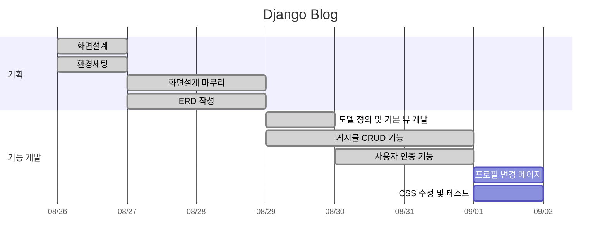
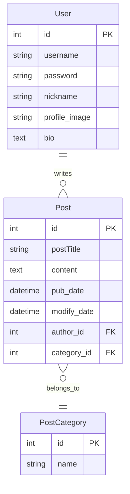

# 📚 ᗷOOKᒪOG
## 기술 스택
     

## 프로젝트 목표
Django의 핵심 기능인 `Admin 인터페이스`, `데이터베이스 관리`, `보안 기능`, 그리고 웹사이트 구축에 필요한 `Django 라이브러리들`을 활용하여 실무적인 기술을 익히고 경험을 쌓는 것을 목표로 합니다.
## 1. 주요 기능
### 1.1. 사용자 인증 시스템
- `django.contrib.auth`를 활용한 회원가입, 로그인 및 사용자 프로필 관리
- Django의 내장 인증 시스템을 이용한 안전한 사용자 인증 처리

   
### 1.2. 게시글 관리
- 게시글 작성, 수정, 삭제 기능
- Django의 ORM을 활용한 카테고리별 게시글 분류 및 조회

### 1.3. 게시글 네비게이션
- Django의 `Paginator` 클래스를 사용한 효율적인 페이지네이션
- `django-filter` 라이브러리를 활용한 카테고리 필터링 및 맞춤형 콘텐츠 접근

## URL 구조(모놀리식)
-  main

| App      | URL                  | View Function  | HTML File Name         | Note                  |
|----------|----------------------|----------------|-------------------------|-----------------------|
| main     | `/`                  | LoginView(Django module)   | main/index.html   | 블로그 초기화면 |
| main     | `main/`              | main           | main/main.html         | 블로그 메인화면      |

- blog

| App      | URL                  | View Function  | HTML File Name         | Note                  |
|----------|----------------------|----------------|-------------------------|-----------------------|
| blog     |  `post/<int:post_id>` | post_detail    | blog/post-view.html     | 글 상세보기     |
| blog     | `post/add/`         | post_add       | blog/post_add.html      | 글 작성            |
| blog     | `post/<int:post_id>/`| post_detail   | blog/post_detail.html   | 글 상세보기         |
| blog     | `post/edit/<int:post_id>/`| post_edit   | blog/post_edit.html   | 글 수정   |
| blog     | `post/update/<int:post_id>/`| post_update   | blog/post_edit.html   | 글 수정 내용 저장  |
| blog     | `post/delete/<int:post_id>/`| post_delete   | blog/post_confim_delete.html   | 글 삭제   |

- accounts

| App      | URL                  | View Function  | HTML File Name         | Note                  |
|----------|----------------------|----------------|-------------------------|-----------------------|
| accounts | `account/signup/`  | signup    | accounts/signup.html| 회원가입 페이지|
| accounts | `accounts/login/`  | LoginView(Django module)     | accounts/login.html| 로그인 페이지|
| accounts | `profile/edit`  | edit_profile     | accounts/profile.html| 프로필 페이지|

## 프로젝트 일정(WBS)

## 데이터베이스 모델링(ERD)

## 화면 설계 기획

## 주요 기능 설명
 실행화면      | 기능 설명                 | 
|----------|----------------------|
|  | 사이트 초기 진입페이지-회원 로그인  | 
|  | 사이트 초기 진입페이지-게스트 입장  | 
|  | 회원가입 - 유효성 검사  | 
|  | 1. 내가 쓴 글보기  2.카테고리별 글 목록 조회  | 
| | 프로필 편집 기능  | 
|  | 게시글 페이징처리  | 
|  | 게시글 보기&수정&삭제  | 

